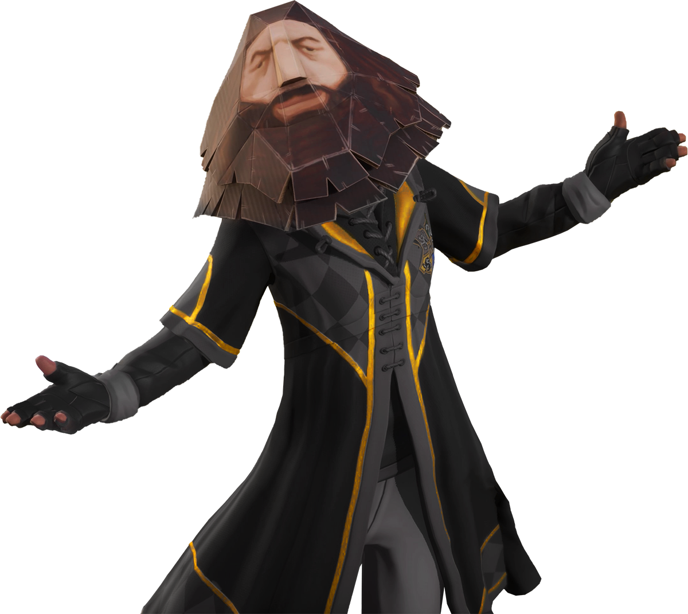

# Welcome to LEAGUE7!
 
Hello Quidditch Champions and PS1 Hagrids,

I, Melanore, am excited to introduce <b>LEAGUE7</b>, a fan-made, community-driven league for [Harry Potter: Quidditch Champions](https://www.quidditchchampions.com/en-us). It is designed to be a transparent and inclusive league, with a structure that ensures every voice is heard. 

Just like at Hogwarts, we're here to build friendships, create some friendly rivalry, and *share the magic with friends and family*. 

I hope you're interested, because I'd like to briefly explain what we have going on here.

## Tryout Season: Your path to glory 

We're kicking things off with our Tryout Season, starting right after the game's launch on September 3rd. Here's what you need to know:

- **Registrations are open now!** You can sign up as an individual player to prove your skills in your main role.
- We will form **four separate divisions**, one for each role. You will compete in the division of your chosen role.
- We will randomly pair you with another participant in your division, weekly. You will have **dual roles** each week:
  - As a *player*: You will compete in a solo queue match during peak hours.
  - As an *observer*: You will watch and verify your partner's match results.
- You will get **new pairings every week** to ensure fair play and diverse experiences.
- We will use a **point system** based on your performance metrics (like badges earned in matches). We'll share full details after the game launches.
- You will play either single matches or best-of-three series &mdash; *the format will be decided by community vote*.

Read more about the [Tryout Season](tryout-season.md). 

## Looking ahead: Regular Seasons

We're planning our regular seasons for when 6v6 custom matches become available (expected Winter 2024). Here's a sneak peek for Defence Against the Dark Arts (DADA) Season:

### Season Structure:
1. **O.W.L.s (Ordinary Wizarding Levels, *i.e.* qualifying round)**:
   - Your team will play against every other team *once*.
   - This phase will run for about 10 weeks (subject to change based on team numbers and official season timelines).
   - You will earn points based on your match performance (for example: a 90-40 win will grant you 90 points plus a winner's bonus).
   - We will collect cumulative points at the end, and your team will get grades, just like in a DADA class.

2. **N.E.W.T.s (Nastily Exhausting Wizarding Test, *i.e.* championship round)**:
   - Only the top 7 teams with highest O.W.L.s scores will play here.
   - You will compete for about 6 weeks, playing each team twice (home and away) in best-of-three series (did someone say nastily exhausting?).
   - We will use simple scoring system: 3 points for a win, 0 points for a loss.
   - If your team has the most points at the end, you will win the season cup and guarantee a place in our hall of fame!

Read more about [Regular Seasons](seasonal-guidelines.md). 

## How we run things

LEAGUE7 is all about being open and involving everyone. Here's a quick look at how we work:
- **President:** You will elect a president who will oversee league operations and ensure fair play.
- **Captains' Council**: If you're a team captain, you will help make big decisions. Every team will have a voice in decisions.
- **Staff and Mods**: We have a team to keep things running smoothly.
- **Your Voice Matters**: You will vote on important changes, and we will constantly seek your ideas and feedback.

Read more about our [Organizational Setup](organizational-guidelines.md). 

## Join Us!

Hopefully, I made it clear that LEAGUE7 is more than just playing Quidditch &mdash; it's about being part of a friendly community. Hop into our Discord to meet other players, get updates, and help shape LEAGUE7!

Join [LEAGUE7 Discord](https://discord.gg/nekcxCwrHc).

We're looking forward to seeing you in the game!

Whether you're aiming to be the next Viktor Krum or just want to enjoy a game of Quidditch with fellow fans, there's a place for you here! 

Let's have some fun!

&mdash; *Melanore*

