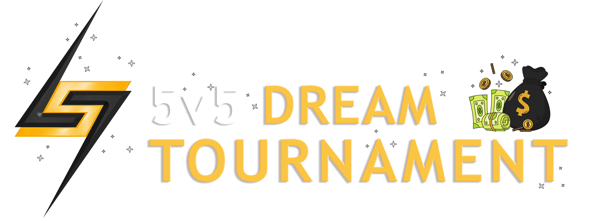

# 5v5 Dream Tournament 🏆 

LEAGUE7 presents our most competitive tournament yet, where standardized loadouts and reduced team sizes will separate the truly skilled from the rest. No fancy brooms or optimized builds to hide behind—just pure talent and teamwork in this high-stakes competition!

This tournament will not be for the faint-of-heart, made to test the mettle of each and every participant, ensuring that their hard-earned-skill and natural-born-talent is brought to the forefront. This effective 'Hard Mode' will establish a standard broom and skill-tree build for each role, making sure everyone is on equal footing with only their abilities to separate them! 

## Event Details

- **Date:** Saturday & Sunday, March 22-23, 2025
- **Format:** Single-elimination tournament (Best of three) up to semi-finals, best of five for Finals
- **Team Size:** 5 players (2 Chasers, 1 Beater, 1 Keeper, 1 Seeker)
- **Substitutes:** No substitutes allowed; team rosters are locked after registration
- **Participants:** Maximum 20 teams (first come, first served)
- **Prize Pool:** $500 ($100 per player on winning team), sponsored by Virtual Witchcraft (@sirfelix)

## Standardized Loadouts

All players must use these exact builds throughout the tournament:

### Chasers
- **Broom:** Nimbus
- **Build:**
  - Quaffle Handling: 5
  - Teamwork: 3
  - Tackling: 0

### Beaters
- **Broom:** Nimbus
- **Build:**
  - Bludger Handling: 5
  - Teamwork: 3
  - Tackling: 0

### Keeper
- **Broom:** Nimbus
- **Build:**
  - Defence: 6
  - Teamwork: 1
  - Attacking: 3

### Seeker
- **Broom:** Nimbus
- **Build:**
  - Seeking: 6
  - Defence: 0
  - Disruption: 0

## Tournament Rules 
1. All standard LEAGUE7 rules, game rules, and [Code of Ethics](/codeofethics) apply
2. All participants must be in good standing with no active bans/suspensions
3. Each team must use exactly the specified loadouts for every match
4. **Any deviation from the required loadouts may result in automatic disqualification**
5. The 6th position in each match will be filled by a volunteer/designated 3rd chaser who will:
   - Not actively participate in gameplay
   - Verify all players have appropriate loadouts during the match
   - Provide additional verification when needed
6. Teams must have at least one (1) person streaming in the dedicated VC at all times 
8. Teams may elect to either queue snipe or load into a custom match with all default match settings
   - Maps may be decided by Captains' agreement

## Official Broadcasting
LEAGUE7 will use this tournament to launch our official streaming platform, [**Twitch**](https://www.twitch.tv/league7qc)! 

## Registration
- Registration opens soon via a dedicated form on this page below
- Teams must confirm availability for both tournament days
- First come, first served (maximum 20 teams)
- Registration confirmation and additional details will be provided on Discord
