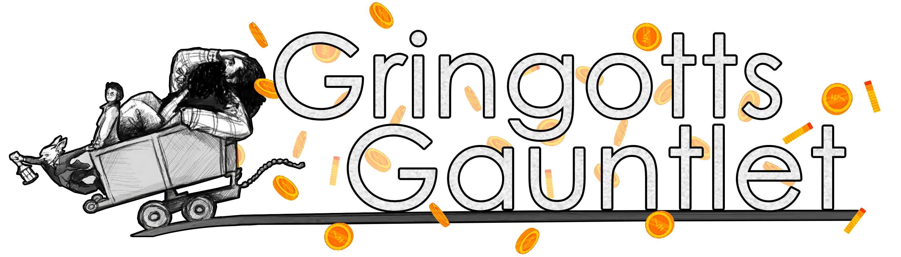

# The Gringotts Gauntlet
*No Galleons, No Glory.*

Gather your grit, grab your gear, and get ready to gamble your fate in League7’s most gloriously goblin-approved tournament yet. 

Welcome to the Gringotts Gauntlet — a gleaming gamble of gold, glory, and the great unknown. 

This two-day auction draft tournament tasks captains with bidding for their rosters using a limited stash of galleons. With strategy, timing, and a bit of magic, you’ll build your team from a vault of hopefuls. But spend wisely — once your gold is gone, it’s gone.

## Schedule 

**Day 1: The Vault Draft** - Friday, April 18, 1:00 PM PST (Captains-only)
- Auction-style player draft 
- Each captain receives 2,500 galleons  
- Captains bid on all signed-up players in randomized order  

**Day 2: The Gauntlet Games** - Saturday, April 19, 1:00 PM PST (All participants)
- Single-elimination tournament format
- Matches: Best of 3 through semifinals
- Finals & 3rd place match: Best of 5

## Rules & Details

### Initial Setup
- All standard LEAGUE7 rules, game rules, and [Code of Ethics](/codeofethics) apply
- Event requires 24+ player sign-ups to proceed
    - Minimum 4 teams, maximum 8 teams
    - Each team consists of 1 captain + 5 players (6 total)
- Each captain begins the draft with a 2,500 galleon budget to bid on players.  
- All bidding takes place in real-time within the designated Discord channel.
    - Discord participation is required for all players

### Nomination & Draft Process  
- Captains will take turns nominating a player for auction. The nomination order is randomized at the start of the draft.  
- Captains have 60 seconds to **nominate a player** 
  - Failure to nominate within time limit results in 100 galleon penalty for each delay.
- Once a player is nominated, a 60-second **bidding window** begins.  
  - Bids must increase by increments of 100 galleons.  
  - The highest valid bid at the end of the timer wins the player.  
- A valid bid is the first timestamped bid that is at least 100 galleons more than the previous one. 
  - Process will be streamed and the streamer's Discord window determines the final state of the bids.
  - Bids lower than the current highest are invalid and ignored.  
- If no bids are placed, the nominating captain purchases the player for 100 galleons.  
- Captains must always retain 100 galleons per remaining open roster slot.  
  - Example: If a captain has 4 empty spots, they must have at least 400 galleons remaining.  
- Once a captain fills their 6-player roster, they no longer bid or nominate.

### Draft Completion 
- The draft ends when all captains have completed their rosters.  
- Unselected players will not be assigned to any team.  
- Tournament staff hold final say in all disputes or rule clarifications.

### Tournament Format 
- The tournament uses a single elimination format.  
- All matches are Best of 3, except for the Finals and 3rd Place Match, which are Best of 5.

## Prize Vault
This event is sponsored by Skipper13, Beesman and JimTones with a total prize pool of $601!
- 1st Place Team: $60 per player  
- 2nd Place Team: $25 per player  
- 3rd Place Team: $15 per player  

In the case of emergency subs or backups, prize adjustments will be handled at the discretion of Staff.

## Broadcasting Notes
- Only one match per round will be streamed officially  
- Other players may stream their own POVs  
- The drafting process may be recorded and posted for community viewing  

## Registration & Captain Applications
<a href="https://docs.google.com/forms/d/e/1FAIpQLSdWjcRl5ZxN_5oxrb-vHkYmyEDFjySHzjmt-oRHFK7ynGGEwg/viewform?usp=sharing"  target="_blank" style="display: inline-block; padding: 12px 22px; background-color: #ffbd00; color: black; text-decoration: none; font-weight: bold; border-radius: 4px; text-align: center;">The Gringotts Gauntlet: REGISTER AS A SUBSTITUTE!</a> 

Fortune favors the bold. Guard your gold. Gamble for glory.  
*Welcome to the Gringotts Gauntlet.*