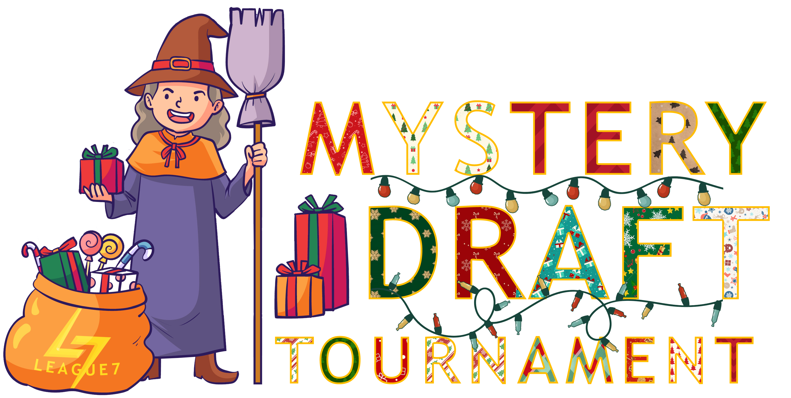

# Holidays At L7: Mystery Draft Tournament 🎁
Take a break from the usual competitive grind and join us for LEAGUE7's most laid-back tournament of the year! This casual, holiday-themed event puts the fun first with our unique mystery draft system where finding out who's on your team is half the entertainment! Like opening presents on Christmas morning, you never know what (or who!) you'll get when each mystery box is unwrapped.

No pressure, no expectations - just good times with good company. Bring your holiday spirit and sense of adventure as we close out the year with this festive celebration of Quidditch!

**Special Thanks to Our Sponsor**: This event's prizes are generously sponsored by Skipper13! Each player on the winning team will receive $5.

## Event Details 

- **Date:** Saturday, December 28th, 2024  
- **Time:** 3:00 PM EST (Full-day event)  
- **Format:** Double elimination tournament*  
- **Matches:** Best of three
- **Participants:** Minimum 24 players (4 teams), maximum 48 players (8 teams)

*Note: Format will switch to single elimination if more than 6 teams are generated.*

## Rules and Registration 

1. All standard LEAGUE7 rules apply (see [**Code of Ethics**](/codeofethics))
2. Submit your LEAGUE7 individual player registration (see [**Registration**](/registration)) if you haven't (no need to resubmit)
3. Submit your application through the form below to participate in this event
   - Applications will be processed in order of submission (first come, first served)
   - You will receive the event role on Discord within 24 hours as confirmation

## The Mystery Draft System 

### Captain Selection
- Beater positions will serve as team captains
- Number of captains will be determined by final participant count (4-8 captains)
- Captain positions assigned based on application timestamp

### Draft Process
Our holiday-themed draft event incorporates a unique "present box" system:

1. Players will be sorted into *mystery present boxes*
2. During the draft round, captains can either:
   - Select from previously revealed players
   - Unwrap a new mystery box and select one player from it

**Example Draft Round:**
1. Captain 1 unwraps Present Box 1
   - Three players are revealed
   - Captain selects one player
2. Captain 2's turn:
   - Can choose from the two remaining revealed players
   - OR unwrap a new present box (must select from new box if opened)
3. Process continues until all players are drafted

## Important Notes
- Players must be available for the full duration of the event
- Check-in required 30 minutes before draft begins, late arrivals will not be accommodated once the draft begins
- All tournament communication will be conducted through the #mystery-draft channel
- Each team will be assigned a private text channel after the draft
- Tournament schedule and format may adjust based on final participant count

## Winners' Holiday Prize
This tournament's prizes are sponsored by Skipper13 and are managed by them:
- Each player on the winning team will receive $5
- Prize distribution will be handled directly by Skipper13
- All prize-related questions should be directed to Skipper13
 
## Registration Form

    

    

        <iframe src="https://docs.google.com/forms/d/e/1FAIpQLSeTftATxOcFs01fcc5qSqcDJ90u9oiU7tN5zeB5aozBLHqGYw/viewform?embedded=true" width="600" height="1100" frameborder="0" marginheight="0" marginwidth="0">Loading…</iframe>
    

    

