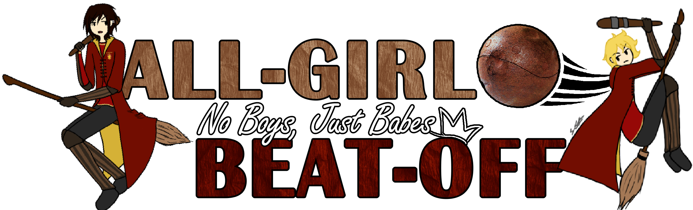

# No Boys, Just Babes: All-Girl Beat-Off🏏
"No Boys, Just Babes" is a 1v1 beater tournament for all female-identifying players in Harry Potter: Quidditch Champions. Bludgers will fly. Heads will roll. One badass will walk away with unmatched reflexes, unrivaled aim, and full Discord GIF privileges.

This competitive solo event features a round-robin format where players compete individually as Beaters, tracking eliminations for points.

## Tournament Structure
- **Date:** Sunday, May 18, 2025 4:20 PM PST
- **Player Limit:** 10 participants maximum
- **Format:** 1v1 Round Robin
- **Match Settings:** Custom matches (half-field only)
- **Team Configuration:** 1 Player (Beater role only), designated referees will join teams for observation

## Standardized Equipment
- **Broom:** Nimbus
- **Skill Tree:** 
  - Bludger Handling 4
  - Teamwork 3
  - Tackling 3

**Deviating from the standard loadout will result in the following penalties:**
1. First violation: Verbal warning and required respec
2. Second violation: -10 points
3. Third violation: Disqualification

## General Offense System
The following **prohibited actions** will be tracked under the general offense system:
- Midline Violation: Crossing to the broadcaster's side of the field
- Stalling (Lack of Engagement): 20+ seconds without active engagement (hit, tackle, or a clear attempt)
- Targeting the Chaser: Intentional interference with the Chaser

**Each type of rule violation is tracked individually:**
1. First offense: Verbal warning
2. Second offense: -5 points
3. Third offense: -10 points
4. Fourth offense: Disqualification

*Note: All in-game mechanics (for example, bludger dribbling) are permitted within the tournament rules.*

## Scoring System & Victory Determination
- Each opponent Beater elimination = 10 points
    - Penalty points will be subtracted from total points
- The player with the most points across all matches becomes the Champion
- Tiebreaker: First to 3 eliminations in a sudden death match

## Prize Pool
This event is sponsored by ManonAelin13 with a total of $150!
- **1st Place:** 
    - $75 prize
    - Unique discord role: Queen of Chaos
    - Crown emoji in display name
    - GIF posting privileges in LEAGUE7 Discord server for 1 week
- **2nd Place:** $45 prize
- **3rd Place:** $30 prize

## Eligibility Requirements
- All standard LEAGUE7 rules, game rules, and [Code of Ethics](/codeofethics) apply
- Players must be a member of the LEAGUE7 Discord server
- Players must be available for the full duration of the event and must attend all scheduled matches on time

For any questions or concerns about the tournament, please use #event-general channel in LEAGUE7 Discord.

## Registration 
<a href="https://docs.google.com/forms/d/e/1FAIpQLScZvDXT9AIc-7V7SKdRyosXePDt6yYffUCMwprpZlbLQ0WUIg/viewform?usp=sharing"  target="_blank" style="display: inline-block; padding: 12px 22px; background-color: #ffbd00; color: black; text-decoration: none; font-weight: bold; border-radius: 4px; text-align: center;">REGISTER AS A BEATER</a> 

For any questions or concerns about the tournament, please use #event-general channel in Discord.