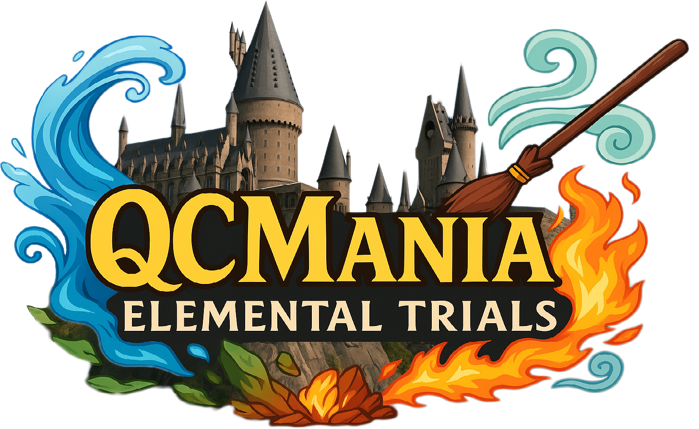

## QCMania

Welcome to **QCMania** - the ultimate competitive Quidditch Champions tournament where Nations clash across four elemental trials! Each trial tests different aspects of magical gameplay, from lightning-fast Seeker duels to coordinated team strategies. Compete for glory, prizes, and Core Shards while representing your Nation in this epic championship.

> ## 07/19 Updates
>
> To keep QCMania consistent, competitive, and clear across all gameplay-based Trials, we are updating the format for Fire and Earth to match the structure used in Air. This ensures equal match opportunities, cleaner progression, and easier understanding across the board.
>
> **New Standardized Format (Trials of Air, Fire, and Earth)**
>- 2 Cohorts (Group A & Group B)
>- Each cohort has 1 representative per Nation (4 total)
>- Each player or team plays 3 round robin matches in their group
>- Best-performing player or team from each Nation advances to the Final 4
>- Final 4 is a single elimination bracket
>
> **New Trial of Fire Format:**
>- Two Round Robin Groups: Group A (Player A from each Nation), Group B (Player B from each Nation)
>- Each player plays 3 matches in their group (7 minutes each, 10 minutes including setup)
>- Best performer from each Nation advances to Final 4 single-elimination bracket
>- No spawn camping allowed - violation = disqualification
>- Any legal skill tree/loadout permitted
>- Most Eliminations Wins
>
>**New Trial of Earth Format:**
>- Two Round Robin Groups: Group A (Player A from each Nation), Group B (Player B from each Nation)
>- Each player plays 3 matches in their group (7 minutes each, 10 minutes including setup)
>- Best team from each Nation advances to Final 4 single-elimination bracket
>
>**Participation Rewards:**
>- Trial of Air: 300 Core Shards per player
>- Trial of Fire: 300 Core Shards per player
>- Trial of Earth: 300 Core Shards per player
>
>**Clarification:** Trial of Earth Core Shards
>- All Core Shard rewards in Trial of Earth are awarded per player, not per team
>- Each member of a 4-person team earns full credit for match wins and Grand Final victories

## Event Schedule

- Saturday, July 19 – Trial of Air (Seeker 1v1) & Trial of Fire (Beater Brawl KO duels)  
- Sunday, July 20 – Trial of Earth (Quaffle Royale team showdown) + Closing Awards

## General Tournament Rules

### **Participation & Substitutions**
- Each Nation may designate 1 reserve player per trial
- Reserves may substitute only if a main player drops before their first scheduled match
- No substitutions allowed once matches begin

### **Match Integrity & Reporting**
- Players must remain in designated Discord rooms until their match
- At least one player per match must share screen via VDO.Ninja
- Match results must be promptly reported to staff in the respective results thread
- Posts must include screenshot of match result, tag both Nations, and use correct `[Nation] Winner` tag

### **Technical Issues & Restart Protocol**
- If experiencing technical issues (desync, rubberbanding, high ping), immediately spam **"Bloody Hell"** in in-game chat as official distress signal and exit match
- Match restart only granted if progress is under 50%
- Maximum 2 restarts per match permitted
- Staff will verify issues through chat logs and match footage

### **Core Shards Scoring**
- Maximum 1000 Core Shards available per player per trial
- Base 100 Core Shards for participation in each trial
- Additional shards awarded for match wins and advancement
- All earned shards contribute to Nation totals

---

# The Four Trials

## Trial of Air
*Sponsored by: xXLghtFuryXx*

**The Challenge:** Lightning-fast Seeker duels testing reflexes and Snitch-catching prowess.

**Format:**
- Two Round Robin Groups: Group A (Player A from each Nation), Group B (Player B from each Nation)
- Each player plays 3 matches in their group (7 minutes each, 10 minutes including setup)
- Best performer from each Nation advances to Final 4 single-elimination bracket
- 3 points per win, tie-breakers: head-to-head, Snitch catch time, total Snitch points

**Schedule:** ~3 hours total
- Round Robin Groups: 2 hours (1 hour each)
- Final 4: 30 minutes
- Buffer/breaks: 30 minutes

**Core Shards Distribution:**
- Participation: 100
- Round Robin wins: 3 × 150 = 450
- Final 4 wins: 2 × 225 = 450

**Special Rules:**
- Restart only if both players' Snitch meters below 50%

**Prize:** Winner receives **Nimbus 2000 & Golden Snitch** collectible from The Noble Collection (6.5" resin crafted)

---

## Trial of Fire
*Sponsored by: tediready*

**The Challenge:** Explosive Beater elimination duels showcasing combat mastery.

**Format:** 
- Single elimination bracket, random seeding
- 1v1 Beater duels scored by total eliminations
- Final 4 matches are best of 3, all others best of 1
- No spawn camping allowed - violation = disqualification
- Any legal skill tree/loadout permitted

**Schedule:** ~2 hours total
- Opening Round: 40 minutes
- Semifinals: 30 minutes
- Final: 30 minutes
- Buffer/breaks: 20 minutes

**Core Shards Distribution:**
- Participation: 100
- Round Wins: 2 × 150 = 300
- Final 4 Wins: 2 × 225 = 450
- Level Bonus: +75 (under level 500) or +100 (under level 250)

**Prize:** Top two Beaters each receive **€25 Steam Gift Card**

---

## Trial of Earth 
*Sponsored by: TBA*

**The Challenge:** Pure teamwork and coordination - Keeper and Chaser gameplay only.

**Format:**
- Double elimination bracket
- Teams of 4 (1 Keeper + 3 Chasers per team)
- Best of 1 matches (Grand Final may be best of 3)
- No Seekers or Beaters - Quaffle-only gameplay
- Standard LEAGUE7 settings (Champion level)

**Schedule:** ~3 hours total
- Opening Rounds: 1.5 hours
- Elimination Bracket & Finals: 1 hour
- Buffer/breaks: 30 minutes

**Core Shards Distribution:**
- Participation: 100
- Match Wins: Up to 5 × 150 = 750
- Grand Final Win: 150

**Special Rules:**
- Must use private custom lobbies
- Only Chaser and Keeper roles allowed
- Accidental role selection may result in forfeit

**Prize:** TBA

---

## Trial of Water
*Sponsored by: PumkinSnatch*

**The Challenge:** Community support and content creation - every contribution counts.

**Who Can Participate:**
- Volunteers helping during Quidditch Mania
- Stream viewers engaging in live chat
- Social media supporters
- Content creators (clips, edits, highlights)

**How to Enter:**
- Post content on X, QC Discord, or r/QuidditchChampionsPro
- Use hashtag **#QuidditchChampions**
- Tag @wbgames and @QuidditchGame on X
- Volunteer for event coordination

**Core Shards Distribution:**

| Activity | Core Shards |
|----------|-------------|
| Volunteer (full event) | 500 |
| Volunteer (per shift) | 150 |
| Streaming full match | 200 |
| Valid clip/meme post | 100 |
| Social media promo | 50 |
| Watching & chatting full stream | 150 |
| Top Contributor Bonus | +150 |

**Prize Categories:**
- **Volunteer MVP** - Event support standout
- **Best Clip/Edit** - Most creative content
- **Top Social Hype** - Biggest online presence
- **Stream Presence Award** - Best chat reactions

**Prizes:** $20-25 gift cards (Nintendo eShop, PlayStation Store, Steam, Xbox Store)

**Submission:** Use Trial of Water Submission Thread with Discord name, Nation, screenshot/link, and description

---

# Register as a Volunteer

Each trial demands different skills - speed, strategy, teamwork, and community spirit. Whether you're catching Snitches, landing Bludger hits, coordinating Quaffle plays, or hyping from the sidelines, every contribution matters.

<a href="https://forms.gle/Xw1pPfFKG4egkM5a9"  target="_blank" style="display: inline-block; padding: 12px 44px; background-color: #ffbd00; color: black; text-decoration: none; font-weight: bold; border-radius: 4px; text-align: center;">REGISTER TO QCMANIA</a> 

Good luck, represent your Nation with pride, and may the best witches and wizards win!