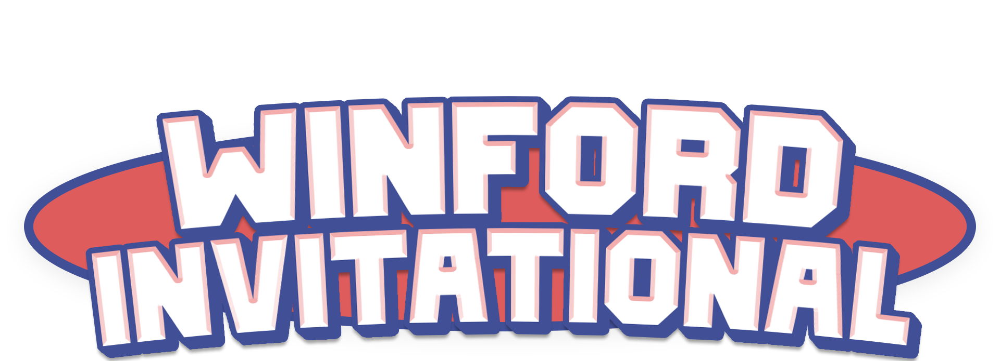

## Winford Invitational (in association with LEAGUE7)

As LEAGUE7, we are excited to support the **Winford Invitational** as an exciting community-driven 2v2 tournament event! While this is not an official LEAGUE7 tournament, we're collaborating to help bring this event to life in response to the community's interest in diverse competitive experiences in Quidditch Champions. 

Before you jump into details, we want to clarify the following key points:
- As an independently run event, Winford will be primarily responsible for tournament operations and issue resolution.
- LEAGUE7's role is to provide logistical support and a community platform.
- We're working closely with Winford to ensure the best possible experience for all participants, while keeping to his requested event timeline.
- This collaboration serves as a valuable opportunity for us to gather insights that will help improve future events and league operations.

We appreciate your understanding and enthusiasm as we explore new ways to enhance the competitive Quidditch Champions scene. Your participation and feedback are crucial, and we'll use this experience to refine our approach to community events moving forward.

## Details & Rules
- **Date & Time:** Saturday, October 12, 2024, at 2 PM EST (1 PM CST)
- **Registration Deadline:** Saturday, October 12, 2024, at 12 PM EST (11 AM CST)

### Requirements
- **Teams:** Teams will consist of 2 players, Beater and Keeper duos. No seekers.
- **Team Outfits:** Players must have matching outfits for their team.
- **Code of Ethics:** All participants must adhere to LEAGUE7's [**Code of Ethics**](/codeofethics).

### Tournament Format
- 16 teams will be hand-selected by Winford during his stream from the pool of registered teams.
- A bracket will be generated through Challonge and published on this page.
- 2 commentators will join teams as Seekers. They will immediately pull away from the action and avoid engaging with the gameplay.
- Teams will queue at the same time, playing in a single elimination format with best of 3 matches per series.
- Players can freely change skill builds and brooms between matches.

### Registration
1. Register your 2-player team through the form at the end of this page.
   - Deadline: Saturday, October 12, 2024, at 12 PM EST (11 AM CST)
2. Join the LEAGUE7 [**Discord**](https://discord.gg/Ph8GUq3veh) for event communications.
3. Tune in to the live stream on Winford's [**Twitch**](https://www.twitch.tv/winford) channel.

### Viewer Interaction & Engagement
- **MVP Polls:** After each match series, viewers can vote for the MVP via chat polls.
- **Viewer Predictions:** Viewers can predict match outcomes before each game.
- **Trivia:** (If a moderator is available) Quidditch-themed trivia will be hosted in chat between matches.

### Post-Tournament Recognition
- Winners will be recognized and featured in LEAGUE7's Hall of Fame.
- Highlight reels may be created from recorded gameplay

## Questions?
Please drop any queries about the event through the [**live stream**](https://www.twitch.tv/winford) or **#winford-invitational** text channel in LEAGUE7 [**Discord**](https://discord.gg/Ph8GUq3veh) server.

## Registration Form
If you have read and understood the tournament details and requirements above, please proceed to register for the Winford Invitational!

See you all on the pitch!

  

    <iframe src="https://docs.google.com/forms/d/e/1FAIpQLSdqpjspwzbn4Qc2SqflCiaubIzLD_AUHQNILVzOxVK5WEifbA/viewform?embedded=true" width="640" height="1600" frameborder="0" marginheight="0" marginwidth="0">Loading…</iframe>
 

